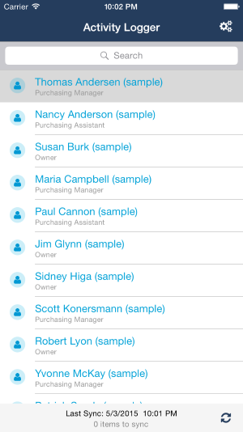

# Azure Activity Logger iOS pre-built app

This is a pre-built iOS app for connecting to Dynamics CRM Online. After deploying your backend, you should customize your client settings to connect to your deployed backend.

See the [instructions here to configure the client app](../MobileServicesCrm#8-configure-and-run-the-client-app).

## Using the app

If you haven't logged in, pressing the sync botton in the lower right will prompt you for your Active Directory credentials that are associated with your Dynamics CRM tenant. To create a "check in" task, select a contact from the list and select the checkbox. Note that only contacts that are owned by the logged in user will be synchronized.

The footer at the bottom of the screen will show when the last sync operation occurred and how many items are remaining to sync.

